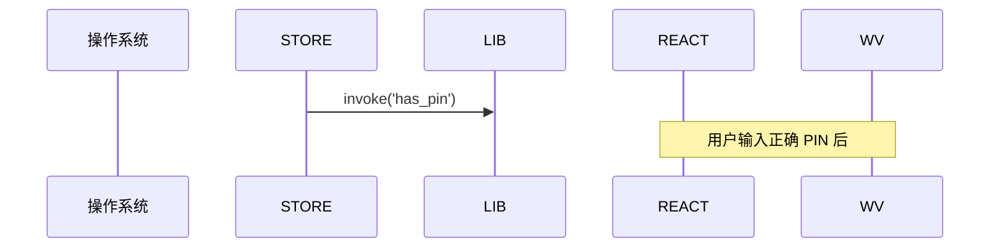
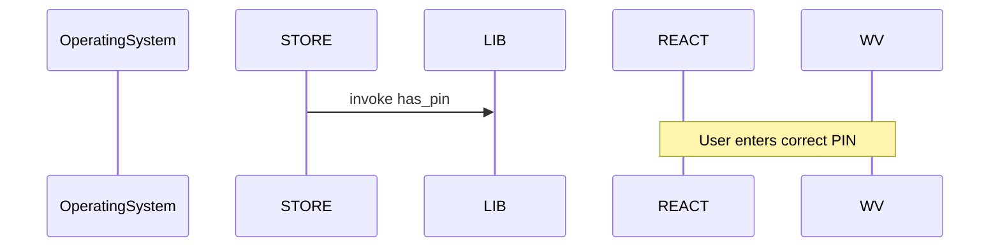

# CLAUDE.md

## Commands
bun install
bun run build

## Mermaid Diagram Rules

All Mermaid diagrams in this project must follow these rules — no exceptions.

### Language
- All text inside diagrams must be in **English only**
- No Chinese or any other non-ASCII language inside diagram syntax

### Forbidden Syntax
- No HTML entities: `&lt;` `&gt;` `&amp;` — use plain text instead
- No HTML tags: ` ` — use a single line or split into separate nodes
- No special characters in labels: `§` `()` `<>` `{}` — simplify or remove
- No parentheses in arrow labels: `-->|invoke()|` → use `-->|invoke|`

### Safe Patterns
- `subgraph` titles: plain English words only, quotes are fine
- Node labels: plain text, no markup
- Arrow labels: short English phrases, no punctuation
- `alt/else` branches in sequenceDiagram: English only
- `Note over`: English only

### Examples

Bad:

Good:
