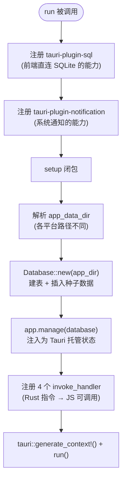
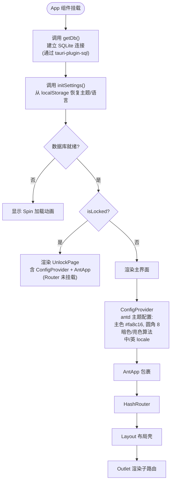
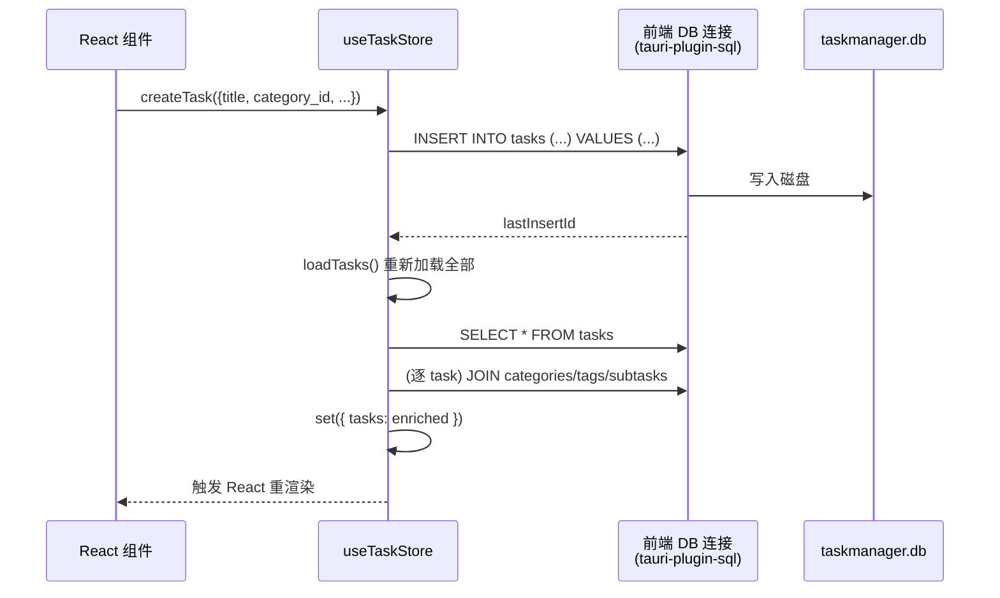
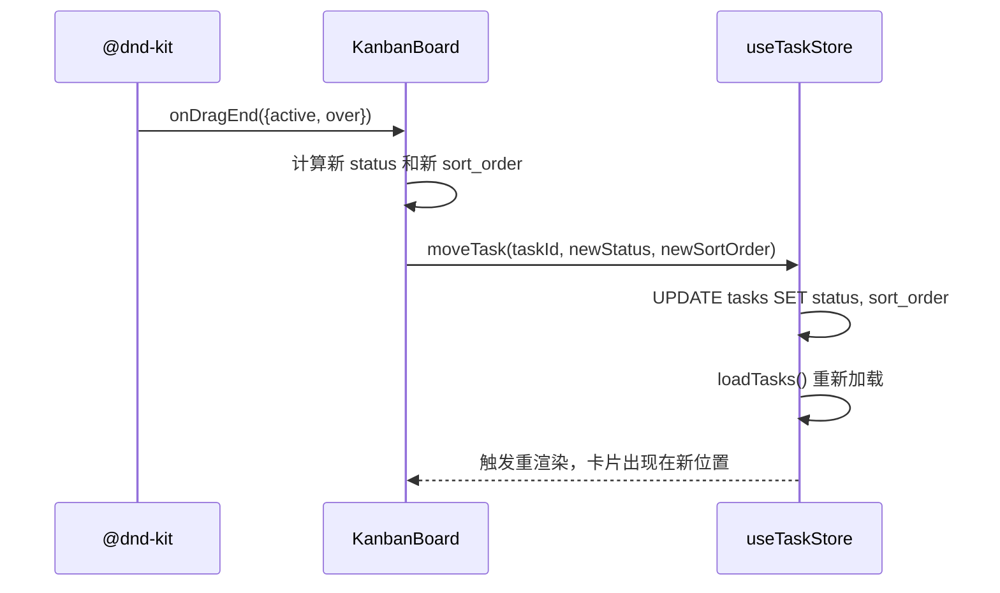
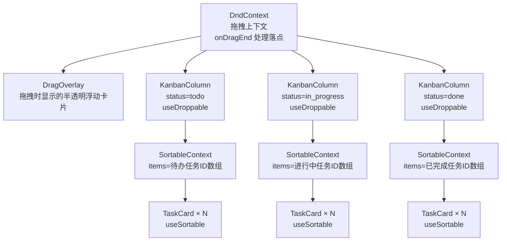
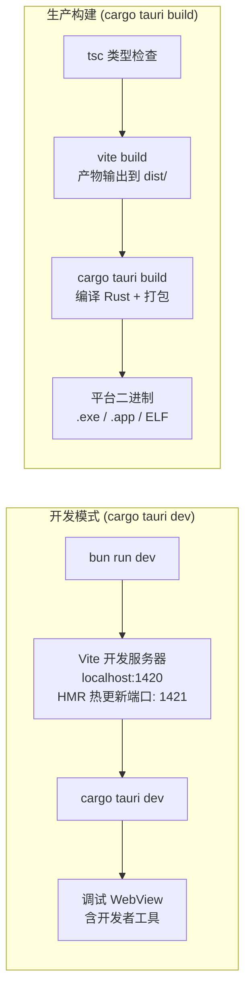

# Task Manager — 架构与技术文档

> 读者定位：本文假设你有基本的 React/TypeScript 和 SQL 知识，但对 **Tauri 框架是新手**。第 2 章专门解释 Tauri 的核心概念，帮助快速上手。

## 目录

1. [项目概览](#1-项目概览)
2. [Tauri 核心概念速览（新手必读）](#2-tauri-核心概念速览新手必读)
3. [技术栈](#3-技术栈)
4. [整体架构](#4-整体架构)
5. [启动流程](#5-启动流程)
6. [运行时依赖关系](#6-运行时依赖关系)
7. [Rust 后端](#7-rust-后端)
8. [React 前端](#8-react-前端)
9. [数据库设计](#9-数据库设计)
10. [数据流](#10-数据流)
11. [组件树与路由](#11-组件树与路由)
12. [构建流水线](#12-构建流水线)

---

## 1. 项目概览

**Task Manager** 是一款基于 Tauri v2 的本地桌面任务管理应用。核心交互采用看板（Kanban）模式，支持拖拽排序、分类筛选、标签管理、子任务清单、PIN 码锁定、数据统计等完整功能。

- **纯本地运行**：所有数据存储在本地 SQLite 文件中，无任何网络请求
- **双语言支持**：中文 / 英文可切换
- **明暗主题**：浅色 / 深色 / 跟随系统
- **PIN 码保护**：bcrypt 哈希存储在 SQLite 中，验证逻辑运行在 Rust 侧

---

## 2. Tauri 核心概念速览（新手必读）

如果你刚接触 Tauri，先花 5 分钟了解这几个概念，后面读起来会顺畅很多。

### 2.1 Tauri 是什么？

Tauri 是一个**用 Web 技术写 UI、用 Rust 写后端逻辑**的桌面应用框架。你可以把它理解为轻量级的 Electron 替代品——但它不打包 Chromium，而是复用操作系统自带的 WebView。

```
┌──────────────────────────────────────────┐
│              你的 Tauri 应用              │
│                                          │
│  ┌────────────┐      ┌───────────────┐   │
│  │  前端 (JS)  │ ←→   │  后端 (Rust)   │   │
│  │  React 等   │      │  指令/插件     │   │
│  └─────┬──────┘      └──────┬────────┘   │
│        │ 运行在              │ 运行在      │
│  ┌─────┴──────┐      ┌──────┴────────┐   │
│  │ 系统 WebView │      │  Rust 原生进程  │   │
│  │ (Edge/Safari)│      │  (直接调 OS API)│   │
│  └────────────┘      └───────────────┘   │
│                                          │
│  最终产物: 一个可执行文件 (几 MB)          │
└──────────────────────────────────────────┘
```

**核心特点：**
- 前端部分就是普通的 HTML/CSS/JS，你可以用 React、Vue、Svelte 等任何框架
- 后端部分用 Rust 编写，编译成原生机器码，性能极高
- 前端和后端之间通过 **IPC**（进程间通信）互相调用
- 应用体积小（通常 3-10 MB），因为没有自带浏览器内核

### 2.2 Tauri 指令（Command）—— Rust 暴露给 JS 的函数

这是 Tauri 最核心的通信机制。**你在 Rust 中定义一个函数，加 `#[tauri::command]` 注解，它就能被前端 JS 调用。**

```rust
// Rust 侧：定义一个指令
#[tauri::command]
fn verify_pin(state: tauri::State<'_, Database>, pin: String) -> Result<bool, String> {
    // ... 业务逻辑 ...
    Ok(true)
}

// 在 run() 中注册
.invoke_handler(tauri::generate_handler![verify_pin])
```

```typescript
// 前端侧：调用这个指令
import { invoke } from '@tauri-apps/api/core';

const ok = await invoke<boolean>('verify_pin', { pin: '123456' });
//        函数名 ^^^^^^^^^^^           参数对象 ^^^^^^^^^^^^^^^^
```

**类比**：就像前端的 `fetch('/api/xxx')`，但这里的"API 服务端"是本地的 Rust 代码，不走网络，直接通过 IPC 通信，极快且安全。

> 在本项目中，只有 PIN 认证相关操作使用 `invoke()` 方式。任务 CRUD 走的是另一条路——插件，下面马上讲。

### 2.3 Tauri 插件（Plugin）—— 给前端提供原生能力

插件是 Tauri 生态中的"能力扩展包"。它封装了某项原生功能，让前端可以直接调用，而不需要你自己写 Rust 指令。

**本项目中用到了两个插件：**

| 插件 | 作用 | 前端怎么用 |
|------|------|-----------|
| `tauri-plugin-sql` | 让 JS 能直接操作 SQLite 数据库 | `import Database from '@tauri-apps/plugin-sql'` |
| `tauri-plugin-notification` | 发送系统桌面通知 | `import { sendNotification } from '@tauri-apps/plugin-notification'` |

**插件的工作方式：**
- 在 Rust 侧通过 `.plugin(xxx)` 注册
- 在 `capabilities/default.json` 中声明权限
- 前端通过 npm 安装对应包后直接 import 使用

```rust
// Rust 侧：注册插件
tauri::Builder::default()
    .plugin(tauri_plugin_sql::Builder::new().build())  // 让前端能用 SQL
    .plugin(tauri_plugin_notification::init())          // 让前端能发通知
```

```json
// capabilities/default.json：声明允许前端使用哪些插件能力
{
  "permissions": [
    "sql:allow-select",            // 允许前端执行 SELECT
    "sql:allow-execute",           // 允许前端执行 INSERT/UPDATE/DELETE
    "notification:allow-notify"    // 允许前端发通知
  ]
}
```

> 本项目的大多数 CRUD 不走 `invoke()` —— `tauri-plugin-sql` 让前端拿到了**直连 SQLite 文件的数据库连接**，前端可以直接写 SQL，更简单直接。

### 2.4 托管状态（Managed State）—— Rust 中的全局共享数据

Tauri 提供 `app.manage(xxx)` 机制，让你把一个 Rust 对象注入到"应用全局"，之后所有 `#[tauri::command]` 都能通过函数参数拿到它。

```rust
// 注入阶段（在 setup 闭包中）：
app.manage(database);  // 把 Database 实例放到全局

// 使用阶段（在任意指令函数中）：
#[tauri::command]
fn has_pin(state: tauri::State<'_, Database>) -> Result<bool, String> {
    // state 就是之前注入的 Database 实例
    // tauri::State 是 Tauri 提供的"从全局取数据"的类型
}
```

**类比**：类似 React 的 Context 或者后端框架的依赖注入——不用手动传来传去，Tauri 自动帮你注入。

> 本项目通过 `app.manage()` 注入了 `Database` 实例。四个 PIN 指令函数都通过 `State<Database>` 参数拿到它。

### 2.5 插件权限（Capabilities）—— Tauri v2 的安全模型

Tauri v2 采用细粒度的权限系统。**前端能调用哪些插件能力，必须在 `capabilities/default.json` 中显式声明。**

```
前端想执行 SQL → Tauri 检查 capabilities 中是否有 "sql:allow-execute"
                → 有 → 放行
                → 没有 → 拒绝，前端收到错误
```

这是一个**白名单机制**——默认什么都做不了，必须显式授权。这在安全上比 Electron 的 `nodeIntegration: true` 强得多。

### 2.6 invoke() 和插件，什么时候用哪个？

| 方式 | 适用场景 | 本项目中的使用 |
|------|---------|--------------|
| **invoke() 调 Rust 指令** | 需要 Rust 侧执行敏感逻辑（加密、哈希等），不想暴露给前端 | PIN 验证/设置——确保 bcrypt 哈希不出 Rust 进程 |
| **插件直接调用** | 标准化的原生能力（数据库、通知等），插件已封装好安全边界 | 任务 CRUD——直接用 `tauri-plugin-sql` 发 SQL |

**经验法则**：如果逻辑需要"只让 Rust 知道的秘密"（密钥、哈希算法等），用 `invoke()`。如果只是常规数据存取，插件更简单直接。

### 2.7 Tauri 应用的生命周期

```
cargo tauri dev / 双击 .exe
        │
        ▼
┌──────────────────────┐
│  Rust main() 启动     │  ← 应用进程开始
│  注册插件             │
│  初始化数据库          │
│  创建 WebView 窗口     │  ← 系统弹出窗口
│  加载前端 HTML        │
└─────────┬────────────┘
          │
          ▼
┌──────────────────────┐
│  WebView 解析 HTML    │
│  执行 JS bundle       │
│  React 渲染 UI        │  ← 用户看到界面
│  Zustand 初始化状态    │
└─────────┬────────────┘
          │
          ▼
┌──────────────────────┐
│  运行中...            │  ← 用户在操作
│  JS ←→ Rust 通过     │
│  IPC 不断通信         │
└─────────┬────────────┘
          │
          ▼
┌──────────────────────┐
│  用户关闭窗口          │  ← 进程终止
│  Rust drop() 清理     │
│  数据库连接关闭        │
└──────────────────────┘
```

---

## 3. 技术栈

| 层级 | 技术 | 用途 |
|------|------|------|
| **桌面框架** | Tauri v2 | 将 Web 前端嵌入系统 WebView，提供 Rust ↔ JS 双向通信 |
| **后端语言** | Rust | PIN 认证指令、数据库初始化、插件注册 |
| **前端框架** | React 18 + TypeScript | 全部 UI 逻辑 |
| **UI 组件库** | Ant Design 5 | 按钮、表单、抽屉、菜单、日期选择等组件 |
| **拖拽** | @dnd-kit/core + sortable | 看板卡片拖拽排序 |
| **图表** | Recharts 3 | 统计页的饼图和柱状图 |
| **状态管理** | Zustand 5 | 认证状态、任务数据、设置偏好 |
| **路由** | React Router DOM v7 (HashRouter) | 前端页面路由 |
| **国际化** | i18next + react-i18next | 中英文切换 |
| **数据库** | SQLite (rusqlite + tauri-plugin-sql) | 本地数据持久化 |
| **密码哈希** | bcrypt (Rust crate) | PIN 码安全存储 |
| **构建工具** | Vite 5 + bun | 前端打包与依赖管理 |
| **日期处理** | dayjs | 日期格式化与计算 |

---

## 4. 整体架构

```mermaid
graph TB
    subgraph "用户桌面"
        WV[系统 WebView<br/>Windows: WebView2<br/>macOS: WKWebView<br/>Linux: WebKitGTK]
    end

    subgraph "Tauri v2 运行时"
        subgraph "Rust 后端"
            MAIN[main.rs<br/>入口点]
            LIB[lib.rs<br/>4 个 Tauri 指令<br/>+ 插件注册]
            DB_RS[db.rs<br/>Database 结构体<br/>Mutex&lt;Connection&gt;]
        end

        subgraph "Tauri 插件"
            SQL_PLUGIN[tauri-plugin-sql<br/>前端直连 SQLite]
            NOTIF_PLUGIN[tauri-plugin-notification<br/>系统通知]
        end
    end

    subgraph "前端 (React + TypeScript)"
        APP[App.tsx<br/>根组件]
        ROUTER[HashRouter]
        subgraph "页面"
            KANBAN[KanbanBoard]
            STATS[StatisticsPage]
            SETTINGS[SettingsPage]
            UNLOCK[UnlockPage]
        end
        subgraph "状态管理 (Zustand)"
            AUTH_STORE[useAuthStore]
            TASK_STORE[useTaskStore]
            SETTINGS_STORE[useSettingsStore]
        end
        DB_FE[db/database.ts<br/>SQLite 连接单例]
    end

    subgraph "持久化"
        DB_FILE[(taskmanager.db<br/>SQLite 文件<br/>WAL 模式)]
        LS[localStorage<br/>主题 / 语言偏好]
    end

    MAIN --> LIB
    LIB --> DB_RS
    LIB --> SQL_PLUGIN
    LIB --> NOTIF_PLUGIN
    DB_RS --> DB_FILE
    DB_FE -->|tauri-plugin-sql| DB_FILE
    AUTH_STORE -->|invoke()| LIB

    WV --> MAIN
    APP --> ROUTER
    ROUTER --> KANBAN
    ROUTER --> STATS
    ROUTER --> SETTINGS
    APP --> UNLOCK
    KANBAN --> TASK_STORE
    STATS --> TASK_STORE
    SETTINGS --> AUTH_STORE
    SETTINGS --> SETTINGS_STORE
    UNLOCK --> AUTH_STORE
    TASK_STORE --> DB_FE
    SETTINGS_STORE --> LS
```

### 架构要点

**双 SQLite 连接（理解本项目架构的关键）：**

Rust 侧通过 `rusqlite` 持有一个连接，**仅用于 PIN 操作**。前端通过 `tauri-plugin-sql` 持有另一个连接，**用于所有任务 CRUD**。两者操作同一个 `taskmanager.db` 文件。

为什么这样设计？

- **安全性**：PIN 的 bcrypt 哈希与验证全在 Rust 侧完成，PIN 哈希永不出 Rust 进程。前端通过 `invoke()` 调用 Rust 指令，拿不到原始哈希——只能得到"验证通过/失败"的布尔结果。
- **便利性**：任务数据没有安全敏感性，让前端通过插件直连 SQLite，省去了为每个 CRUD 操作写 Rust 指令 + invoke 调用的样板代码。

---

## 5. 启动流程

这是整个应用从双击到用户看到界面的完整过程。

```mermaid
sequenceDiagram
    participant OS as 操作系统
    participant BIN as Rust main.rs
    participant LIB as Rust lib.rs (run)
    participant DB as Database (db.rs)
    participant WV as WebView
    participant PLUGIN as tauri-plugin-sql
    participant REACT as React App
    participant STORE as Zustand Stores

    OS->>BIN: 启动可执行文件
    BIN->>LIB: task_manager_lib::run()

    LIB->>LIB: 注册 tauri-plugin-sql
    LIB->>LIB: 注册 tauri-plugin-notification

    LIB->>LIB: setup 闭包执行
    LIB->>OS: 获取 app_data_dir<br/>各平台不同，见 §6

    LIB->>DB: Database::new(app_dir)
    DB->>DB: 创建目录 (fs::create_dir_all)
    DB->>DB: 打开 taskmanager.db
    DB->>DB: PRAGMA journal_mode=WAL
    DB->>DB: PRAGMA foreign_keys=ON
    DB->>DB: init_tables() — 建 7 张表
    DB->>DB: seed_categories() — 插入 3 个默认分类
    DB-->>LIB: Database 实例

    LIB->>LIB: app.manage(database)<br/>注入 Tauri 托管状态
    LIB->>LIB: 注册 4 个 invoke_handler

    LIB->>OS: 创建系统 WebView 窗口<br/>(1200×800, 最小 900×600)
    LIB->>WV: 加载前端资源 (dist/ 或 devUrl)

    WV->>WV: 执行 Vite 打包的 JS
    WV->>REACT: ReactDOM.createRoot → &lt;App/&gt;

    REACT->>PLUGIN: getDb(): Database.load('sqlite:taskmanager.db')
    PLUGIN->>REACT: 返回 SQLite 连接句柄

    REACT->>STORE: initSettings() — 从 localStorage 恢复主题/语言
    REACT->>STORE: useAuthStore.checkPinStatus()
    STORE->>LIB: invoke('has_pin')
    LIB->>DB: SELECT COUNT(*) FROM pin
    DB-->>LIB: count
    LIB-->>STORE: bool

    alt 无 PIN (首次运行)
        STORE->>REACT: isFirstRun=true, isLocked=true
        REACT->>WV: 渲染 UnlockPage (PIN 创建界面)
    else 已有 PIN
        STORE->>REACT: isFirstRun=false, isLocked=true
        REACT->>WV: 渲染 UnlockPage (PIN 输入界面)
    end

    Note over REACT,WV: 用户输入正确 PIN 后

    STORE->>LIB: invoke('verify_pin', {pin})
    LIB->>DB: SELECT pin_hash, bcrypt::verify()
    LIB-->>STORE: true

    STORE->>REACT: isLocked=false
    REACT->>STORE: useTaskStore.loadTasks()
    STORE->>PLUGIN: SELECT * FROM tasks (含关联查询)
    PLUGIN-->>STORE: 任务数据
    REACT->>STORE: useTaskStore.loadCategories()
    REACT->>STORE: useTaskStore.loadTags()

    REACT->>WV: 渲染主界面<br/>(Layout + KanbanBoard)
```

---

## 6. 运行时依赖关系

```mermaid
graph LR
    subgraph "Tauri 进程"
        RUST[Rust 运行时]
        WEBVIEW[WebView 进程]
    end

    subgraph "系统组件"
        WV2[WebView2 / WKWebView / WebKitGTK]
        FS[文件系统]
        NOTIF[系统通知服务]
    end

    subgraph "文件"
        DB_FILE[(taskmanager.db)]
        DIST[dist/ 静态资源]
    end

    RUST -->|启动子进程| WEBVIEW
    WEBVIEW -->|渲染| WV2
    RUST -->|rusqlite| DB_FILE
    WEBVIEW -->|tauri-plugin-sql| DB_FILE
    RUST -->|读写| FS
    RUST -->|tauri-plugin-notification| NOTIF
    WEBVIEW -->|invoke() IPC| RUST
    WEBVIEW -->|加载| DIST
```

| 运行时依赖 | 来源 | 说明 |
|------------|------|------|
| **系统 WebView** | 操作系统自带 | Windows: WebView2 (Edge Chromium)，macOS: WKWebView，Linux: WebKitGTK。用户无需额外安装 |
| **SQLite** | `rusqlite` bundled 编译 | SQLite 引擎静态编译进 Rust 二进制，无需系统安装 SQLite |
| **Vite 开发服务器** | `bun run dev` | 仅开发模式，监听 `localhost:1420`，支持 HMR 热更新 |
| **文件系统** | 操作系统 | 读写 `app_data_dir` 下的数据库文件；`localStorage` 由 WebView 管理 |

**平台数据目录（`app_data_dir`）：**

| 平台 | 路径 |
|------|------|
| Windows | `C:\Users\<user>\AppData\Roaming\com.taskmanager.app\` |
| macOS | `~/Library/Application Support/com.taskmanager.app/` |
| Linux | `~/.local/share/com.taskmanager.app/` |

---

## 7. Rust 后端

### 7.1 文件结构

```
src-tauri/
├── Cargo.toml              # Rust 包清单与依赖声明
├── build.rs                # Tauri 构建脚本（1 行，调 tauri_build::build()）
├── tauri.conf.json         # Tauri 窗口与构建配置
├── capabilities/
│   └── default.json        # 插件权限白名单（Tauri v2 安全模型）
├── icons/                  # 各平台应用图标
└── src/
    ├── main.rs             # 二进制入口 (5 行)
    ├── lib.rs              # 核心逻辑: 4 个指令 + 启动函数 (100 行)
    └── db.rs               # 数据库初始化: 建表 + 种子数据 (104 行)
```

### 7.2 main.rs — 二进制入口

```rust
#![cfg_attr(not(debug_assertions), windows_subsystem = "windows")]

fn main() {
    task_manager_lib::run()
}
```

- `#![cfg_attr(...)]`：在 release 构建中隐藏 Windows 控制台窗口（用户看不到黑框）
- 全部逻辑委托给 `task_manager_lib::run()`
- 库 crate (`lib.rs`) 包含所有实际代码，二进制 crate (`main.rs`) 只是一个极薄的入口

### 7.3 lib.rs — 核心启动与指令

#### run() 函数的执行流程



#### 四个 Tauri 指令（均可被前端 invoke 调用）

| 指令名 | 入参 | 返回值 | 做了什么 |
|--------|------|--------|---------|
| `verify_pin` | `pin: String` | `Result<bool, String>` | 查库取 `pin_hash`，`bcrypt::verify()` 比对 |
| `set_pin` | `pin: String` | `Result<(), String>` | `bcrypt::hash(pin, 4)` → DELETE 旧记录 → INSERT 新哈希 |
| `change_pin` | `old_pin, new_pin` | `Result<bool, String>` | 先验证旧 PIN，再写入新哈希 |
| `has_pin` | 无 | `Result<bool, String>` | `SELECT COUNT(*) FROM pin` → count > 0 |

**bcrypt cost factor 为什么是 4？** 通常是 12-14。这里用 4 是刻意降低计算成本——桌面端的 PIN 很短（4-6 位数字），验证需要在毫秒级完成，cost=4 足够对付本地攻击场景（攻击者需要先突破操作系统才能拿到 db 文件）。

### 7.4 db.rs — 数据库层

```rust
pub struct Database {
    pub conn: Mutex<Connection>,  // rusqlite::Connection 外包一层 Mutex
}
```

**为什么用 `Mutex`？** 因为 Tauri 可能在多个线程上并发调用指令函数（例如同时收到两个 `verify_pin` 调用）。`rusqlite::Connection` 不是线程安全的，必须用 `Mutex` 保护。

**初始化步骤：**

1. `fs::create_dir_all(&app_dir)` — 确保数据目录存在（幂等操作）
2. `Connection::open(db_path)` — 打开或创建 `taskmanager.db`
3. `PRAGMA journal_mode=WAL` — 开启 WAL 模式，允许 Rust 和前端同时持有读连接
4. `PRAGMA foreign_keys=ON` — 启用外键约束，确保数据完整性
5. `init_tables()` — 创建 7 张表（全部 `IF NOT EXISTS`，幂等）
6. `seed_categories()` — 若 `categories` 表为空，插入 3 条默认记录

### 7.5 Cargo.toml 依赖说明

```toml
[dependencies]
tauri = "2"                                    # Tauri 框架核心
tauri-plugin-sql = { version = "2", features = ["sqlite"] }
                                               # SQL 插件（含 SQLite 支持）
tauri-plugin-notification = "2"                # 通知插件
serde = { version = "1", features = ["derive"] }
serde_json = "1"                               # JSON 序列化（指令参数的编解码）
bcrypt = "0.16"                                # PIN 哈希
rusqlite = { version = "0.32", features = ["bundled"] }
                                               # SQLite 引擎（bundled = 静态编译）

[build-dependencies]
tauri-build = "2"                              # 构建时代码生成
```

**`features = ["bundled"]` 是什么意思？** 它让 `rusqlite` 在编译时把 SQLite 的 C 源码一起编译进二进制，用户机器上不需要安装 SQLite。

### 7.6 插件权限 (capabilities/default.json)

Tauri v2 的安全模型要求**显式授权**。以下是本项目声明的权限：

```json
{
  "identifier": "default",
  "permissions": [
    "core:default",                              // Tauri 核心功能（窗口、事件等）
    "sql:default",                               // SQL 插件基础权限
    "sql:allow-load",                            // 允许 Database.load()
    "sql:allow-execute",                         // 允许 execute()（INSERT/UPDATE/DELETE）
    "sql:allow-select",                          // 允许 select()（SELECT 查询）
    "notification:default",                      // 通知插件基础权限
    "notification:allow-notify",                 // 允许发送通知
    "notification:allow-is-permission-granted",  // 允许查询通知权限状态
    "notification:allow-request-permission"      // 允许请求通知权限
  ]
}
```

如果前端代码调用了未声明的能力，Tauri 会直接拒绝并报错。

---

## 8. React 前端

### 8.1 文件结构

```
src/
├── main.tsx                    # ReactDOM.createRoot 挂载点
├── App.tsx                     # 根组件：Provider 嵌套 + 路由 + 认证门控
├── vite-env.d.ts               # Vite 类型声明
├── types/
│   └── index.ts                # 所有 TypeScript 类型定义（~50 行）
├── db/
│   └── database.ts             # SQLite 连接单例（通过 tauri-plugin-sql）
├── i18n/
│   ├── index.ts                # i18next 初始化配置
│   ├── zh-CN.json              # 中文翻译 (~50 个 key)
│   └── en.json                 # 英文翻译 (~50 个 key)
├── stores/
│   ├── useAuthStore.ts         # 认证状态：调用 invoke() 与 Rust 通信
│   ├── useTaskStore.ts         # 任务 CRUD：通过插件直连 SQLite
│   └── useSettingsStore.ts     # 主题/语言偏好：持久化到 localStorage
├── components/
│   ├── Layout.tsx              # 布局壳：TopNav + Outlet
│   ├── TopNav.tsx              # 顶部导航栏（Kanban / 统计 / 设置）
│   ├── KanbanColumn.tsx        # 看板列：可放置 + 可排序
│   ├── TaskCard.tsx            # 任务卡片：可拖拽
│   ├── TaskDrawer.tsx          # 任务编辑抽屉（右侧滑出）
│   └── PinInput.tsx            # PIN 码输入组件
└── routes/
    ├── UnlockPage.tsx          # 解锁/设置 PIN 页面
    ├── KanbanBoard.tsx         # 看板主页（拖拽容器）
    ├── StatisticsPage.tsx      # 统计仪表盘
    └── SettingsPage.tsx        # 设置页面
```

### 8.2 App.tsx — 根组件的条件渲染逻辑



**为什么用 HashRouter 而不是 BrowserRouter？** Tauri 生产环境使用的是 `file://` 协议加载前端资源，`BrowserRouter` 依赖 History API，在 `file://` 下路由刷新会 404。`HashRouter` 把所有路由放在 `#` 之后，不触发文件请求，在 Tauri 中开箱即用。

**三条路由（均嵌套在 Layout 内）：**

| 路径 | 页面 | 说明 |
|------|------|------|
| `/` | KanbanBoard | 看板主视图，默认页 |
| `/statistics` | StatisticsPage | 统计图表 |
| `/settings` | SettingsPage | PIN 修改 / 主题 / 语言 |
| `*` | → 重定向至 `/` | 兜底 |

### 8.3 三个 Zustand Store 的职责与通信方式

```mermaid
graph TB
    subgraph "useAuthStore<br/>通信方式: invoke() → Rust 指令"
        AS_S["状态: isLocked, isFirstRun"]
        AS_A["操作: unlock, setPin, changePin, lock, checkPinStatus"]
        AS_A -->|invoke()| TCMD["Rust #[tauri::command]"]
    end

    subgraph "useTaskStore<br/>通信方式: db.select/execute → 插件直连 SQLite"
        TS_S["状态: tasks, categories, tags, loading<br/>searchQuery, filterCategory, filterPriority"]
        TS_A["操作: createTask, updateTask, deleteTask<br/>moveTask, createCategory, deleteCategory<br/>createTag, deleteTag, setTaskTags<br/>addSubtask, toggleSubtask, deleteSubtask"]
        TS_A -->|db.select/execute| TSQL["tauri-plugin-sql"]
    end

    subgraph "useSettingsStore<br/>通信方式: localStorage 读写"
        SS_S["状态: theme, language"]
        SS_A["操作: setTheme, setLanguage, initSettings"]
        SS_S --> LS[localStorage]
    end
```

**为什么两种通信方式并存？**

- **useAuthStore** → `invoke()`：PIN 认证是安全敏感操作。bcrypt 哈希在 Rust 侧计算、存储、比对，JS 永远拿不到哈希值。前端只能得到"对/错"的布尔结果。
- **useTaskStore** → 插件：任务 CRUD 无安全敏感性。如果为每个 SQL 操作写一个 Rust 指令，会多出几十个 `#[tauri::command]` 和对应的 `invoke()` 调用，纯属样板代码。插件让前端直接发 SQL，简洁高效。

### 8.4 useTaskStore 关键实现细节

**loadTasks 采用 N+1 查询模式：**

```
1. SELECT * FROM tasks ORDER BY sort_order         → 拿到所有任务
2. 对每个 task:
   a. SELECT * FROM categories WHERE id = ?        → 关联分类
   b. SELECT tag_id FROM task_tags WHERE task_id = ? → 查关联关系
   c. SELECT * FROM tags WHERE id IN (...)          → 查标签详情
   d. SELECT * FROM subtasks WHERE task_id = ?      → 查子任务
3. 组装为 TaskWithRelations
   （含 category_name, tags[], subtasks[], subtask_progress）
```

**updateTask 动态构建 SQL**——根据传入的字段动态生成 UPDATE 语句：

```typescript
const sets = keys.map((k, i) => {
  if (k === 'is_pinned') return `is_pinned = $${i + 1}`;  // bool → 0/1
  return `${k} = $${i + 1}`;
});
// 如果传了 {title: "新标题", priority: "high"}：
// → UPDATE tasks SET title = $1, priority = $2, updated_at = datetime('now') WHERE id = $3
```

**每次写操作后全量 reload**：`createTask`、`updateTask`、`deleteTask`、`moveTask` 等方法在执行完 SQL 后都调用 `get().loadTasks()` 重新加载全部任务并触发 UI 重渲染。这种"写后全量刷新"策略在数据量不大时是最简单的保一致性方案。

### 8.5 类型定义 (types/index.ts)

```typescript
// 核心联合类型
type Priority    = 'high' | 'medium' | 'low';
type TaskStatus  = 'todo'  | 'in_progress' | 'done';

// 数据库实体（与 SQLite 表一一对应）
interface Category  { id, name, color, sort_order }
interface Tag       { id, name, color }
interface Subtask   { id, task_id, title, is_completed, sort_order }
interface Task      { id, title, description, notes, category_id,
                      priority, status, due_date, is_pinned,
                      sort_order, created_at, updated_at }

// 前端富化类型（联表查询后的结果）
interface TaskWithRelations extends Task {
  category_name, category_color,     // 从 categories 表 join 的字段
  tags: Tag[],                       // 从 task_tags + tags 关联来的
  subtasks: Subtask[],               // 从 subtasks 表关联来的
  subtask_progress: { done, total }  // 前端计算的进度
}

// UI 专用
interface KanbanColumn { id, title, status }
```

### 8.6 国际化 (i18n)

- 框架：`i18next` + `react-i18next`
- 语言包：静态加载 `zh-CN.json` 和 `en.json`，各约 50 个翻译 key
- 语言检测：读 `localStorage` → 回退 `zh-CN`
- Ant Design locale 联动：选中文时传 `zhCN`，选英文时传 `enUS` 给 `ConfigProvider`

### 8.7 样式策略

- **Ant Design 5** 提供绝大部分组件样式
- 主题定制通过 `ConfigProvider` 的 `token`：主色 `#fa8c16`（橙色），圆角 `8px`
- 暗色模式：`theme.darkAlgorithm` / `theme.defaultAlgorithm` 切换
- 自定义布局：**inline style**，没有 CSS 文件、CSS Module 或 Tailwind

---

## 9. 数据库设计

### 9.1 ER 图

```mermaid
erDiagram
    pin {
        INTEGER id PK
        TEXT pin_hash "bcrypt 哈希值"
        TEXT created_at
        TEXT updated_at
    }

    categories {
        INTEGER id PK
        TEXT name
        TEXT color "hex 颜色，默认 #fa8c16"
        INTEGER sort_order "排序权重，越小越靠前"
    }

    tags {
        INTEGER id PK
        TEXT name "UK 唯一约束"
        TEXT color "hex 颜色"
    }

    tasks {
        INTEGER id PK
        TEXT title
        TEXT description
        TEXT notes
        INTEGER category_id FK
        TEXT priority "CHECK: high / medium / low"
        TEXT status "CHECK: todo / in_progress / done"
        TEXT due_date "可为 NULL"
        INTEGER is_pinned "0 或 1"
        INTEGER sort_order "看板列内排序"
        TEXT created_at
        TEXT updated_at
    }

    subtasks {
        INTEGER id PK
        INTEGER task_id FK "ON DELETE CASCADE"
        TEXT title
        INTEGER is_completed "0 或 1"
        INTEGER sort_order
    }

    task_tags {
        INTEGER task_id PK FK "ON DELETE CASCADE"
        INTEGER tag_id PK FK "ON DELETE CASCADE"
    }

    notifications {
        INTEGER id PK
        INTEGER task_id FK "ON DELETE CASCADE"
        TEXT notify_at
        INTEGER is_fired "0 或 1"
    }

    tasks ||--o{ subtasks : "包含"
    tasks }o--|| categories : "属于"
    tasks ||--o{ task_tags : "关联"
    tags ||--o{ task_tags : "被关联"
    tasks ||--o{ notifications : "触发"
```

### 9.2 完整建表 SQL

```sql
-- PIN 码存储（单例表：始终只有 0 或 1 行）
CREATE TABLE IF NOT EXISTS pin (
    id         INTEGER PRIMARY KEY AUTOINCREMENT,
    pin_hash   TEXT NOT NULL,
    created_at TEXT NOT NULL DEFAULT (datetime('now')),
    updated_at TEXT NOT NULL DEFAULT (datetime('now'))
);

-- 任务分类
CREATE TABLE IF NOT EXISTS categories (
    id         INTEGER PRIMARY KEY AUTOINCREMENT,
    name       TEXT NOT NULL,
    color      TEXT NOT NULL DEFAULT '#fa8c16',
    sort_order INTEGER NOT NULL DEFAULT 0
);

-- 标签（名称唯一）
CREATE TABLE IF NOT EXISTS tags (
    id    INTEGER PRIMARY KEY AUTOINCREMENT,
    name  TEXT NOT NULL UNIQUE,
    color TEXT NOT NULL DEFAULT '#fa8c16'
);

-- 核心任务表
CREATE TABLE IF NOT EXISTS tasks (
    id          INTEGER PRIMARY KEY AUTOINCREMENT,
    title       TEXT NOT NULL,
    description TEXT NOT NULL DEFAULT '',
    notes       TEXT NOT NULL DEFAULT '',
    category_id INTEGER NOT NULL REFERENCES categories(id),
    priority    TEXT NOT NULL DEFAULT 'medium'
                CHECK(priority IN ('high','medium','low')),
    status      TEXT NOT NULL DEFAULT 'todo'
                CHECK(status IN ('todo','in_progress','done')),
    due_date    TEXT,
    is_pinned   INTEGER NOT NULL DEFAULT 0,
    sort_order  INTEGER NOT NULL DEFAULT 0,
    created_at  TEXT NOT NULL DEFAULT (datetime('now')),
    updated_at  TEXT NOT NULL DEFAULT (datetime('now'))
);

-- 子任务
CREATE TABLE IF NOT EXISTS subtasks (
    id           INTEGER PRIMARY KEY AUTOINCREMENT,
    task_id      INTEGER NOT NULL REFERENCES tasks(id) ON DELETE CASCADE,
    title        TEXT NOT NULL,
    is_completed INTEGER NOT NULL DEFAULT 0,
    sort_order   INTEGER NOT NULL DEFAULT 0
);

-- 任务-标签 多对多关联
CREATE TABLE IF NOT EXISTS task_tags (
    task_id INTEGER NOT NULL REFERENCES tasks(id) ON DELETE CASCADE,
    tag_id  INTEGER NOT NULL REFERENCES tags(id) ON DELETE CASCADE,
    PRIMARY KEY (task_id, tag_id)
);

-- 通知提醒（已建表，前端功能尚未接入）
CREATE TABLE IF NOT EXISTS notifications (
    id        INTEGER PRIMARY KEY AUTOINCREMENT,
    task_id   INTEGER NOT NULL REFERENCES tasks(id) ON DELETE CASCADE,
    notify_at TEXT NOT NULL,
    is_fired  INTEGER NOT NULL DEFAULT 0
);
```

### 9.3 种子数据

仅在 `categories` 表为空时插入：

```sql
INSERT INTO categories (name, color, sort_order) VALUES
    ('工作', '#f5222d', 0),   -- 红色
    ('个人', '#fa8c16', 1),   -- 橙色
    ('学习', '#1890ff', 2);   -- 蓝色
```

### 9.4 数据库配置要点

- **WAL 模式**（Write-Ahead Logging）：写操作不阻塞读操作。Rust 和前端各持有一个连接，WAL 保证它们并发访问不出问题。
- **外键约束开启**：`ON DELETE CASCADE` 确保删除任务时自动清理子任务、标签关联、通知。

---

## 10. 数据流

### 10.1 任务创建 → 入库 → UI 刷新



### 10.2 拖拽排序 → 入库 → 重排



### 10.3 PIN 验证（唯一走 invoke 的路径）

```mermaid
sequenceDiagram
    participant UI as UnlockPage
    participant STORE as useAuthStore
    participant INVOKE as invoke() IPC
    participant RUST as Rust lib.rs
    participant DB as rusqlite Connection

    UI->>STORE: unlock(pin: "123456")
    STORE->>INVOKE: invoke('verify_pin', {pin})
    INVOKE->>RUST: 跨进程 IPC 调用
    RUST->>DB: lock().query_row("SELECT pin_hash...")
    DB-->>RUST: Option&lt;hash&gt;
    RUST->>RUST: bcrypt::verify(pin, hash)
    RUST-->>INVOKE: Result&lt;bool, String&gt;
    INVOKE-->>STORE: ok: boolean
    STORE->>STORE: set({ isLocked: false })
    STORE-->>UI: 跳转至主界面
```

---

## 11. 组件树与路由

### 11.1 完整组件树

```
<App>
  └─ <AppInner>
       ├─ (dbReady=false) → <Spin />                          # 数据库连接中
       ├─ (isLocked=true)  → <UnlockPage>                     # 锁屏状态
       │                      └─ <PinInput />                 # 4-6 位数字输入
       └─ (isLocked=false) → <ConfigProvider>                  # antd 主题 + locale
                               └─ <HashRouter>
                                    └─ <Routes>
                                         ├─ <Layout>          # 布局壳
                                         │   ├─ <TopNav />    # 顶部导航
                                         │   └─ <Outlet />
                                         │        ├─ "/" →
                                         │        │   <KanbanBoard>
                                         │        │     ├─ 搜索/筛选栏
                                         │        │     ├─ <DndContext>
                                         │        │     │   ├─ <KanbanColumn status="todo">
                                         │        │     │   │   ├─ <TaskCard /> × N
                                         │        │     │   │   └─ 添加任务输入框
                                         │        │     │   ├─ <KanbanColumn status="in_progress">
                                         │        │     │   ├─ <KanbanColumn status="done">
                                         │        │     │   └─ <DragOverlay /> (拖拽浮动卡片)
                                         │        │     └─ <TaskDrawer /> (右侧抽屉)
                                         │        │
                                         │        ├─ "/statistics" →
                                         │        │   <StatisticsPage>
                                         │        │     ├─ 统计卡片 × 4
                                         │        │     ├─ <PieChart /> × 2
                                         │        │     └─ <BarChart />
                                         │        │
                                         │        └─ "/settings" →
                                         │            <SettingsPage>
                                         │              ├─ 修改 PIN 卡片
                                         │              ├─ 语言切换 (Radio)
                                         │              ├─ 主题切换 (Radio)
                                         │              └─ 锁定按钮
                                         │
                                         └─ "*" → <Navigate to="/" />
```

### 11.2 看板拖拽架构



**@dnd-kit 关键配置：**
- **传感器**：`PointerSensor`，激活距离 `5px`。意味着鼠标按下后需要移动 5px 才算开始拖拽，防止误触
- **跨列拖拽**：`onDragEnd` 中判断 `over` 的容器 id，更新 `status` + 批量重算 `sort_order`
- **同列排序**：仅更新涉及卡片的 `sort_order`

---

## 12. 构建流水线



### 12.1 tauri.conf.json 关键配置说明

```json
{
  "productName": "Task Manager",       // 应用显示名称
  "version": "0.1.0",                  // 应用版本
  "identifier": "com.taskmanager.app", // 唯一标识（用于数据目录、系统注册）
  "build": {
    "frontendDist": "../dist",         // 生产模式从这加载 HTML/JS/CSS
    "devUrl": "http://localhost:1420",  // 开发模式连到这个地址（Vite）
    "beforeDevCommand": "bun run dev", // tauri dev 启动前先执行
    "beforeBuildCommand": "bun run build" // tauri build 打包前先执行
  },
  "app": {
    "windows": [{
      "title": "Task Manager",
      "width": 1200,
      "height": 800,
      "minWidth": 900,
      "minHeight": 600,               // 防止窗口过小导致布局崩溃
      "resizable": true,
      "fullscreen": false
    }],
    "security": {
      "csp": null                     // 不启用 CSP（内联样式用得多）
    }
  }
}
```

### 12.2 npm 脚本

| 命令 | 作用 |
|------|------|
| `bun run dev` | 启动 Vite 开发服务器，支持 HMR |
| `bun run build` | 先 `tsc` 类型检查，再 `vite build` 打包 |
| `bun run preview` | 本地预览 Vite 构建产物（不通过 Tauri） |
| `bun run tauri` | 调用 Tauri CLI（开发/构建的入口） |

---

## 附录 A：关键文件清单

| 文件 | 行数 | 职责 |
|------|------|------|
| `src-tauri/src/main.rs` | 5 | Rust 二进制入口 |
| `src-tauri/src/lib.rs` | 100 | Tauri 启动、4 个指令、插件注册 |
| `src-tauri/src/db.rs` | 104 | SQLite 连接、7 张表建表、种子数据 |
| `src-tauri/build.rs` | 3 | Tauri 构建脚本 |
| `src-tauri/Cargo.toml` | 22 | Rust 依赖声明 |
| `src-tauri/tauri.conf.json` | 28 | Tauri 窗口/构建配置 |
| `src-tauri/capabilities/default.json` | ~15 | 插件权限白名单 |
| `src/main.tsx` | 5 | React 挂载点 |
| `src/App.tsx` | 87 | 根组件：条件渲染 + 路由 + 主题 |
| `src/types/index.ts` | 53 | 全部 TS 类型定义 |
| `src/db/database.ts` | 10 | SQLite 连接单例 |
| `src/stores/useAuthStore.ts` | 40 | PIN 认证状态（invoke Rust 指令） |
| `src/stores/useTaskStore.ts` | 267 | 任务 CRUD 状态（插件直连 SQLite） |
| `src/stores/useSettingsStore.ts` | ~60 | 设置偏好状态（localStorage） |
| `src/components/Layout.tsx` | ~30 | 布局壳 |
| `src/components/TopNav.tsx` | ~40 | 顶部导航栏 |
| `src/components/KanbanColumn.tsx` | ~130 | 看板列 |
| `src/components/TaskCard.tsx` | ~100 | 任务卡片 |
| `src/components/TaskDrawer.tsx` | ~160 | 任务编辑抽屉 |
| `src/components/PinInput.tsx` | ~50 | PIN 输入控件 |
| `src/routes/UnlockPage.tsx` | ~70 | 解锁页 |
| `src/routes/KanbanBoard.tsx` | ~180 | 看板主页（拖拽容器） |
| `src/routes/StatisticsPage.tsx` | ~140 | 统计仪表盘 |
| `src/routes/SettingsPage.tsx` | ~120 | 设置页 |
| `src/i18n/zh-CN.json` | ~50 | 中文翻译 |
| `src/i18n/en.json` | ~50 | 英文翻译 |

## 附录 B：已完成功能清单

| 功能模块 | 功能点 |
|----------|--------|
| **PIN 安全** | 首次设置 PIN、启动解锁、修改 PIN、bcrypt 哈希存储 |
| **看板管理** | 三列看板（待办/进行中/已完成）、添加/重命名/删除列 |
| **任务 CRUD** | 创建、编辑（标题/描述/备注/优先级/分类/截止日期/标签）、删除 |
| **拖拽排序** | @dnd-kit 跨列拖拽、同列排序、Pointer 传感器 5px 防误触 |
| **子任务** | 添加检查项、勾选/取消完成、删除、进度条 |
| **标签系统** | 创建/删除标签、多对多关联、颜色标识 |
| **分类系统** | 3 个默认分类（工作/个人/学习）、自定义颜色 |
| **搜索筛选** | 标题模糊搜索、按分类筛选、按优先级筛选 |
| **统计仪表盘** | 总览卡片（总数/已完成/完成率/逾期）、饼图、柱状图、7/30 天切换 |
| **国际化** | 中文/英文切换，Ant Design locale 联动 |
| **主题** | 亮色/暗色/跟随系统，Ant Design theme algorithm |
| **数据持久化** | SQLite WAL 模式、localStorage 偏好存储 |
